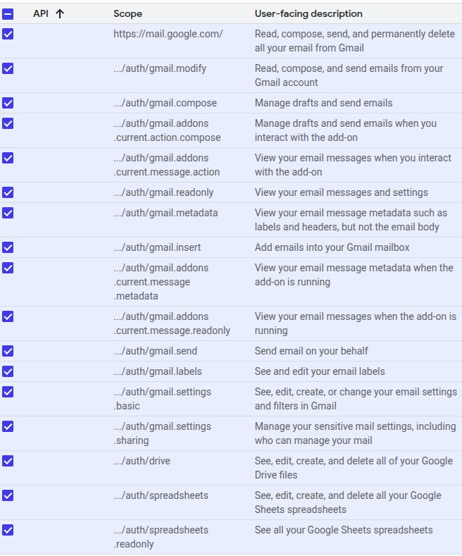

<div align="center" style="background-image: url('roses.jpg'); background-size: cover; padding: 60px; border-radius: 15px; border: 2px solid #f06292; color: #ffffff;">

  <h1 style="color:#ffffff; text-shadow: 2px 2px 4px #000000;">💡 EAG Session 8 · External API RAG Agent System</h1>

  <p style="font-size: 1.2em;"><strong>AI Agents</strong> 🤖 + <strong>External API Integration</strong> 🌐</p>
  <p style="font-size: 1.2em;">✨ Gmail · Telegram · Google Sheets · Web Search · SSE</p>

</div>

---

### 🎯 Use Case

> **Send a message to your Agent via Telegram:**  
> _"Find the Current Point Standings of F1 Racers, then put that into a Google Excel Sheet, and then share the link to this sheet with me (your email)."_

✅ The agent will:
- Fetch latest Formula 1 standings 🌍  
- Save the data to a Google Sheet 📊  
- Share the spreadsheet via Gmail 📩  
- ✅ **Send message to Telegram and see the score in Gmail**

---

### 🧩 What's Included

- 🔌 Telegram interface
- 📬 Gmail API support
- 📁 Google Sheets + Drive integration
- 🌐 Live Web Search via stdio server
- 🏎️ MCP Tool for F1 scores using SSE server

---

### 📁 File Breakdown

| File | Description |
|------|-------------|
| `main.py` | Entry point for running agent loop |
| `agent.py` | Core logic that invokes tools |
| `telegram_msg_intercepter.py` | Telegram bot handler |
| `creds_create.py` | Creates and formats credentials |
| `mcp/gmail_and_sheet_server.py` | Manages Gmail & Sheets |
| `mcp/web_search_server.py` | SSE-based search tool |
---

### ☁️ Google Cloud Setup

#### Step 1: Create Project & Enable APIs

- Open [Google Cloud Console](https://console.cloud.google.com/)
- Create a new project
- Enable:
  - Google Sheets API
  - Google Drive API
  - Gmail API

#### Step 2: Service Account Setup

- Go to **APIs & Services > Credentials**
- Create **Service Account**
- Generate and download `.json` key file

#### Step 3: OAuth 2.0 Setup

- Create **OAuth Client ID** (Desktop App)
- Add **Test Users** (your email)
- Add Scopes shown below:

<div align="center" style="background: #fce4ec; padding: 10px; border-radius: 12px;">
  
</div>

> 💡 *Scopes grant access to Gmail, Sheets, Drive services*

---

### 💬 Setup Telegram Bot

1. Chat with [@BotFather](https://t.me/botfather)
2. Use `/newbot` to generate token
3. Add `TELEGRAM_TOKEN` to your environment config

---

### 🌱 Environment Variables

```bash
GEMINI_API_KEY=your_gemini_key
TELEGRAM_TOKEN=your_bot_token
DRIVE_FOLDER_ID=your_google_drive_folder_id
TOKEN_PATH=/absolute/path/google_env/app_tokens.json
CREDENTIALS_PATH=/absolute/path/google_env/credentials.json
SERVICE_ACCOUNT_PATH=/absolute/path/google_env/service_account.json
CREDENTIALS_CONFIG={...output_of_creds_create.py...}
```

---

### ▶️ How to Run

```bash
# Start Gmail and Sheet service
python3 mcp/gmail_and_sheet_server.py

# Start SSE Web Search server
python3 mcp/web_search_server.py

# Start Telegram Message Interceptor
python3 telegram_msg_intercepter.py
```

💬 **Now send this message to your Telegram bot**:  
> *“Find the Current Point Standings of F1 Racers, then put that into a Google Excel Sheet, and then share the link to this sheet with me (your email).”*

✅ The bot will:
- Fetch live F1 standings  
- Create and upload a spreadsheet to your Google Drive  
- Send the sheet link **to your Gmail inbox**

---
